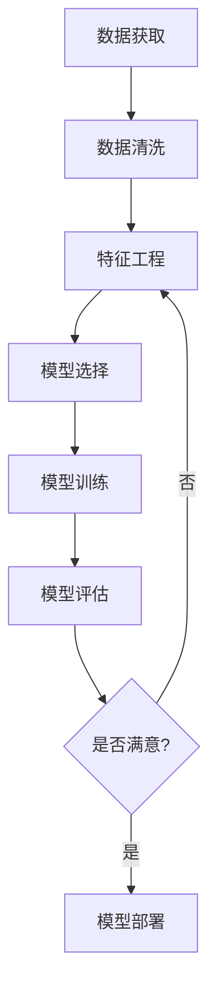

<div align="center">

# 🤖 AI 开发学习之路

> 从理论到实践的完整机器学习学习路径记录


[](https://github.com/YDaria/Personal-Knowledge-Base/stargazers)
[](https://github.com/YDaria/Personal-Knowledge-Base/network/members)

---

### 📚 学习路线图


---

</div>

## 📖 项目简介

这是一个系统记录我从零开始学习 AI 和机器学习全过程的知识库项目。从基础概念到经典算法，再到实际项目案例，每一部分都包含详细的理论讲解和可视化说明。

**适用人群：**
- 机器学习初学者
- 想要系统学习 AI 的开发者
- 需要快速回顾 ML 算法的工程师

## 🎯 学习路径

### 第一阶段：基础概念
| 章节 | 内容 | 难度 | 预计时长 |
|:---:|:---|:---:|:---:|
| 📌 [机器学习概述](./机器学习-ML/一、机器学习概述.md) | AI/ML/DL 概念、发展史、术语、建模流程 | ⭐ | 2小时 |

### 第二阶段：监督学习
| 章节 | 内容 | 难度 | 预计时长 |
|:---:|:---|:---:|:---:|
| 🔍 [KNN 算法](./机器学习-ML/二、KNN算法.md) | K近邻分类、距离度量、K值选择 | ⭐⭐ | 3小时 |
| 📈 [线性回归](./机器学习-ML/三、线性回归.md) | 最小二乘法、梯度下降、正则化 | ⭐⭐⭐ | 4小时 |
| 🔄 [逻辑回归](./机器学习-ML/四、逻辑回归.md) | Sigmoid函数、交叉熵损失、多分类 | ⭐⭐⭐ | 4小时 |
| 🌳 [决策树](./机器学习-ML/六、决策树.md) | 信息增益、基尼系数、剪枝策略 | ⭐⭐⭐ | 5小时 |
| 🚀 [集成学习](./机器学习-ML/七、集成学习.md) | Bagging、Boosting、随机森林、XGBoost | ⭐⭐⭐⭐ | 6小时 |

### 第三阶段：无监督学习
| 章节 | 内容 | 难度 | 预计时长 |
|:---:|:---|:---:|:---:|
| 🎯 [KMeans 聚类](./机器学习-ML/八、KMeans聚类算法.md) | 聚类原理、K值选择、评价指标 | ⭐⭐⭐ | 3小时 |
| 🎲 [朴素贝叶斯](./机器学习-ML/九、朴素贝叶斯.md) | 贝叶斯定理、特征独立性假设 | ⭐⭐ | 2小时 |

### 第四阶段：实战案例
| 章节 | 内容 | 难度 | 预计时长 |
|:---:|:---|:---:|:---:|
| 💼 [时序预测案例](./机器学习-ML/十、数据挖掘案例-南方电网时序预测.md) | 南方电网时序预测完整项目流程 | ⭐⭐⭐⭐ | 8小时 |

## 💡 核心知识点

### 🎓 三大概念
- **人工智能 (AI)**: 机器模拟人类智能
- **机器学习 (ML)**: 让机器从数据中自动学习
- **深度学习 (DL)**: 基于神经网络的机器学习方法

### 📊 学习方式对比

| 方式 | 特点 | 适用场景 |
|:---:|:---|:---|
| **规则学习** | 基于if-else规则 | 简单问题、规则明确 |
| **模型学习** | 从数据中学习规律 | 复杂问题、规律隐含 |

### 🔄 算法分类

```
监督学习 (有标签)
├── 分类任务 (目标值离散)
│   ├── 二分类 (垃圾邮件检测)
│   └── 多分类 (图像识别)
└── 回归任务 (目标值连续)
    └── (房价预测)

无监督学习 (无标签)
├── 聚类 (客户细分)
└── 降维 (数据可视化)

半监督学习 (少量标签 + 大量未标签)

强化学习 (奖励机制)
└── 游戏AI、自动驾驶
```

### 🛠️ 机器学习建模流程



### ⚙️ 特征工程

> "数据和特征决定了机器学习的上限，而模型和算法只是逼近这个上限而已。"

| 步骤 | 说明 |
|:---:|:---|
| **特征提取** | 从原始数据中提取相关特征 |
| **特征预处理** | 归一化、标准化等 |
| **特征选择** | 选择重要特征子集 |
| **特征降维** | PCA等降维方法 |
| **特征组合** | 合并多个特征 |

### 📉 模型拟合问题

| 状态 | 训练集表现 | 测试集表现 | 原因 |
|:---:|:---:|:---:|:---|
| **欠拟合** | 差 | 差 | 模型过于简单 |
| **过拟合** | 好 | 差 | 模型过于复杂/数据量小 |
| **正常拟合** | 好 | 好 | 模型复杂度适中 |

> **奥卡姆剃刀原则**: 给定两个具有相同泛化误差的模型，较简单的模型比较复杂的模型更可取。

## 🛠️ 开发环境

### 安装依赖

```bash
# Python 3.7+
pip install scikit-learn

# 相关科学计算库
pip install numpy scipy matplotlib pandas jupyter
```

### 核心工具

| 工具 | 用途 |
|:---:|:---|
| **NumPy** | 高效数值计算 |
| **SciPy** | 科学计算工具 |
| **Matplotlib** | 数据可视化 |
| **Pandas** | 数据处理和分析 |
| **Scikit-learn** | 机器学习算法库 |
| **Jupyter** | 交互式编程环境 |

## 📈 AI 发展历程

| 时期 | 标志事件 | 技术流派 |
|:---:|:---|:---:|
| **1950-1970** | 图灵国际象棋程序、IBM跳棋程序 | 符号主义 |
| **1980-2000** | SVM提出、IBM深蓝战胜卡斯帕罗夫 | 统计主义 |
| **2010-2017** | AlexNet、AlphaGo战胜李世石 | 深度学习 |
| **2017-至今** | Transformer、BERT、GPT、ChatGPT | 大规模预训练 |

## 🎮 应用领域

- 🎨 **图像识别**: 人脸识别、物体检测、自动驾驶
- 🗣️ **语音处理**: 语音识别、语音合成、机器翻译
- 📝 **自然语言处理**: 情感分析、文本摘要、对话系统
- 📊 **推荐系统**: 商品推荐、内容推荐、个性化服务
- 🏥 **医疗健康**: 疾病诊断、药物研发、医学影像
- 🏭 **工业制造**: 质量检测、预测性维护、工艺优化
- 💰 **金融风控**: 信用评估、欺诈检测、量化交易
- 🌐 **搜索引擎**: 网页排序、广告精准投放

## 🔧 三大发展要素

```
┌─────────────┐
│    数据     │  ← 大数据时代提供海量训练数据
└──────┬──────┘
       │
       │ 相互作用
       │
┌──────┴──────┐
│   算法      │  ← 深度学习等算法突破
└──────┬──────┘
       │
       │ 相互作用
       │
┌──────┴──────┐
│   算力      │  ← GPU/TPU加速训练
└─────────────┘
```

| 处理器 | 特点 | 适用场景 |
|:---:|:---|:---|
| **CPU** | 任务调度、I/O密集型 | 通用计算 |
| **GPU** | 并行计算、矩阵运算 | 深度学习训练 |
| **TPU** | 专为神经网络设计 | TensorFlow生态 |

## 📚 学习建议

### 初学者
1. ✅ 先理解基本概念和术语
2. ✅ 每个算法都要手写实现一遍
3. ✅ 使用公开数据集练习
4. ✅ 重视特征工程

### 进阶者
1. 🔄 多个算法对比，理解适用场景
2. 🔄 关注模型评估和调参
3. 🔄 尝试解决真实业务问题
4. 🔄 学习最新论文和技术

### 实践者
1. 💼 参与Kaggle等竞赛
2. 💼 贡献开源项目
3. 💼 撰写技术博客
4. 💼 持续学习新技术

## 🎯 学习目标

通过本知识库，您将能够：

- [ ] 理解机器学习的基本概念和发展历程
- [ ] 掌握监督学习和无监督学习的核心算法
- [ ] 熟练使用 scikit-learn 进行模型训练和评估
- [ ] 理解特征工程的重要性和常用方法
- [ ] 能够解决实际的分类、回归和聚类问题
- [ ] 具备阅读论文和持续学习的能力

## 📝 学习作业

### 基础练习
- [ ] 完成机器学习概述的思维导图
- [ ] 说明有监督学习和无监督学习的特点及区别
- [ ] 描述机器学习的建模流程
- [ ] 谈谈对特征工程的理解
- [ ] 说明模型拟合问题及产生的原因

### 实战练习
- [ ] 安装配置开发环境
- [ ] 使用 KNN 完成 Iris 数据集分类
- [ ] 用线性回归预测房价
- [ ] 用逻辑回归进行二分类任务
- [ ] 使用决策树进行分类
- [ ] 实现随机森林和 XGBoost
- [ ] 用 KMeans 进行数据聚类
- [ ] 完成时序预测案例项目

## 🤝 贡献指南

欢迎对本知识库提出建议和改进：

1. 📖 Fork 本仓库
2. 🔧 创建特性分支 (`git checkout -b feature/AmazingFeature`)
3. ✅ 提交更改 (`git commit -m 'Add some AmazingFeature'`)
4. 📤 推送到分支 (`git push origin feature/AmazingFeature`)
5. 🔀 开启 Pull Request

## 📄 许可证

本项目采用 [MIT License](LICENSE) 许可证

## 📮 联系方式

如有问题或建议，欢迎通过以下方式联系：

- 📧 Email: [your-email@example.com]
- 💬 Issues: [GitHub Issues](https://github.com/YDaria/Personal-Knowledge-Base/issues)

---

<div align="center">

**⭐ 如果这个项目对您有帮助，请给个 Star 支持一下！**

Made with ❤️ by YDaria

[⬆ 回到顶部](#-ai-开发学习之路)

</div>
